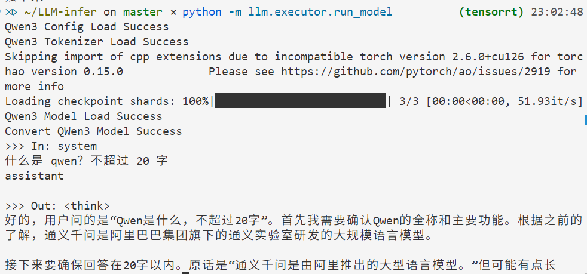

# 大模型推理

由于好奇大模型推理的原理，学习了 [tiny-llm](https://skyzh.github.io/tiny-llm/week1-07-sampling-prepare.html) 课程并将苹果芯片相关代码适配 Nvidia 芯片，遂有了本仓库。侧重 GPU 优化技术，完成 Qwen3-4B-Instruct-2507 模型的本地部署和推理加速。显存不够可以考虑 Qwen3-0.5B，主要是学技术。

<p align="center">
    
</p>

## pre-requirements

- 需要 Nvidia 显卡，安装 cuda 环境，以及 pytorch
- 为测试代码准性，需要安装 torchao 和 torchtune
- 为了加载 huggingface 的 Qwen3 model，需要安装 transformers。如果网络失败，需要 `export HF_ENDPOINT=https://hf-mirror.com`

我的版本：

```
torch                     2.6.0+cu126
torchao                   0.15.0
torchtune                 0.6.1
transformers              4.57.6
triton                    3.2.0
```

## QWen3 实现与本地部署

| 任务                                                     | 测试命令                                                                    |
| -------------------------------------------------------- | --------------------------------------------------------------------------- |
| ✅ Task 1: 实现 `scaled_dot_product_attention`            | `python -m unittest llm.test.attention_test.TestScaleDotAttention`          |
| ✅ Task 2: 实现 `MultiHeadAttention`                      | `python -m unittest llm.test.attention_test.TestMultiHeadAttention`         |
| ✅ Task 3: 实现 `RoPE` 旋转位置编码                       | `python -m unittest llm.test.rope_test`                                     |
| ✅ Task 4: 实现 `RMSNorm` 标准化                          | `python -m unittest llm.test.norm_test`                                     |
| ✅ Task 5: 实现千问的 `MLP`                               | `python -m unittest llm.test.mlp_test`                                      |
| ✅ Task 6.1: `scaled_dot_product_attention` 添加 GQA 支持 | `python -m unittest llm.test.attention_test.TestScaleDotAttention`          |
| ✅ Task 6.2: `MultiHeadAttention` 添加 GQA 支持           | `python -m unittest llm.test.attention_test.TestGroupedMultiHeadAttention ` |
| ✅ Task 7: 实现 `tied embedding`                          | `python -m unittest llm.test.tie_embedding_test.TestTieEmbedding`           |
| ✅ Task 8: 实现 `Qwen3 TransformerBlock`                  | 暂时没想到测试方法                                                          |
| ✅ Task 9: 加载 Qwen3-4B-Instruct-2507 模型，简单推理     | `python -m llm.executor.run_model` 执行推理                                 |


## 工程优化

| 优化                                                        | 测试命令                                       |
| ----------------------------------------------------------- | ---------------------------------------------- |
| ✅ Task 1.1: 解决重复生成问题，实现 `TopK` 采样              | `python -m llm.executor.run_model --topk 100`  |
| ✅ Task 1.2: 解决重复生成问题，实现 `TopN` 采样              | `python -m llm.executor.run_model --topp 0.7`  |
| ✅ Task 2: 实现 PD 分离与 KV Cache                           | `python -m llm.executor.run_model --kv_cache`  |
| ✅ Task 3: 学习 CUDA 或 triton(建议)，实现 FlashAttention V1 | ` python -m unittest llm.test.flash_attn_test` |

- page attention
- flash attention
- continuous batching

## 服务设计

- scheduler

# 结语

大模型从对话到最终落地还有很多[优化技术](https://www.bilibili.com/video/BV1Bm6bB5EJ3/?spm_id_from=333.337.search-card.all.click&vd_source=08fc039ce87a61f2dd6954658b5ae2b5)，但这些优化技术更侧重大模型的服务和 Agent，更像大模型时代后端工程师的工作内容

- Speculative Decoding：用一个小而快的草稿模型提前预测多个 token，再用大模型并行验证这些预测。
- Memory：长期记忆和短期记忆的管理工具。
- RAG(Retrieval-Augmented Generation)：生成前先检索外部知识，让回答更准确、最新。
- MCP(Model Context Protocol)：大模型与外部数据源和工具之间的通信协议。
- Skills：有了 MCP 就可以调用多个工具，skills 定义了多个工具该如何搭配使用，是 Agent 的操作指南。

RAG 涉及数据库和向量检索，Memory 的历史记忆涉及摘要生成，也许会用其他技术来记录用户的操作习惯。however，这些东西每家公司的实现方式都不同，没有什么统一的标准答案，和 GPU 优化关系不大。由于本人的工作和大模型服务/Agent相差甚远，所以对大模型推理框架的探索到此结束，后面会去看多卡训练相关的项目。

# 参考

- [tiny-llm](https://github.com/skyzh/tiny-llm)
- [torch MultiHeadAttention 转置](https://github.com/pytorch/pytorch/blob/main/torch/nn/functional.py#L5945)
- [torch 实现 RoPE](https://github.com/meta-pytorch/torchtune/blob/main/torchtune/modules/position_embeddings.py)
- [RoPE 公式推导](https://spaces.ac.cn/archives/8265/comment-page-1)
- [torch 实现 RMSNorm](https://docs.pytorch.org/docs/stable/generated/torch.nn.RMSNorm.html)
- [Qwen 实现 MLP](https://github.com/huggingface/transformers/blob/main/src/transformers/models/qwen2/modeling_qwen2.py)
- [GQA 概念](https://machinelearningmastery.com/a-gentle-introduction-to-multi-head-attention-and-grouped-query-attention/)
- [Tie Embedding](https://www.spaces.ac.cn/archives/9698)
- [vllm 中 Qwen3 实现](https://github.com/vllm-project/vllm/blob/main/vllm/model_executor/models/qwen3.py)
- [大模型推理为什么需要采样、惩罚](https://zhuanlan.zhihu.com/p/1981752176578667658)
- [看图学 KV Cache](https://zhuanlan.zhihu.com/p/662498827)
- [triton 入门](https://zhuanlan.zhihu.com/p/684473453)
- [FlashAttention 公式推导](https://courses.cs.washington.edu/courses/cse599m/23sp/notes/flashattn.pdf)